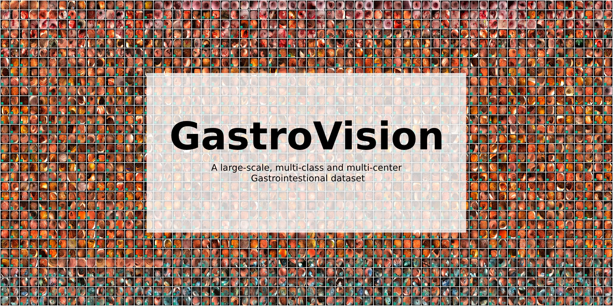
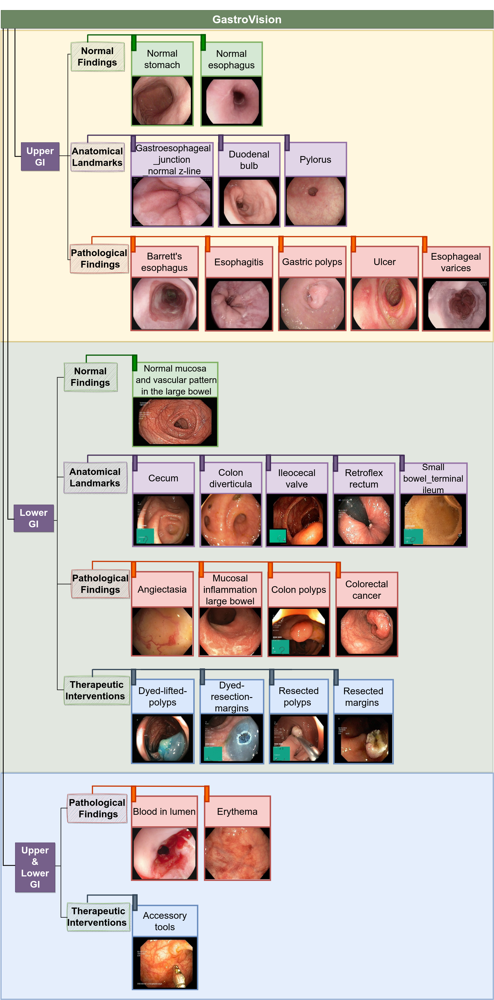
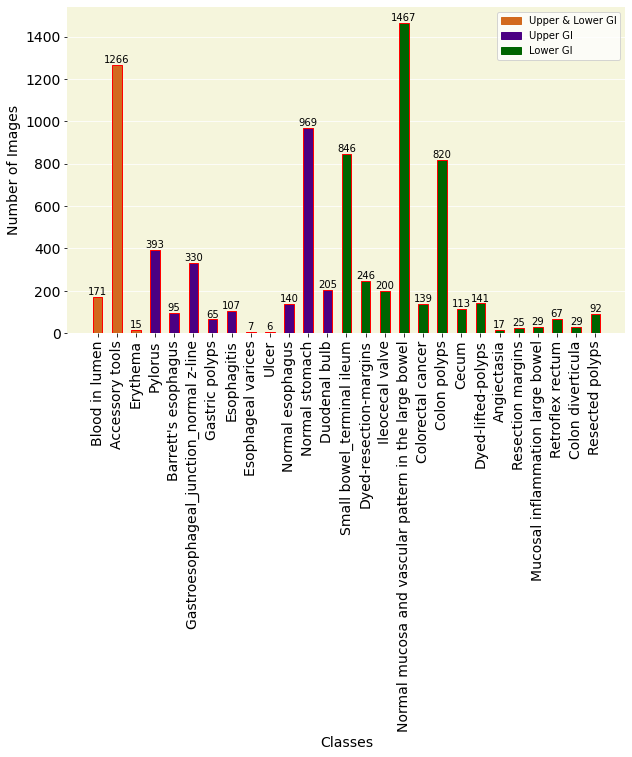
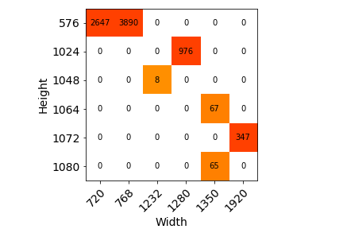
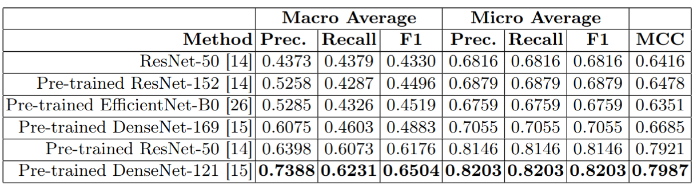
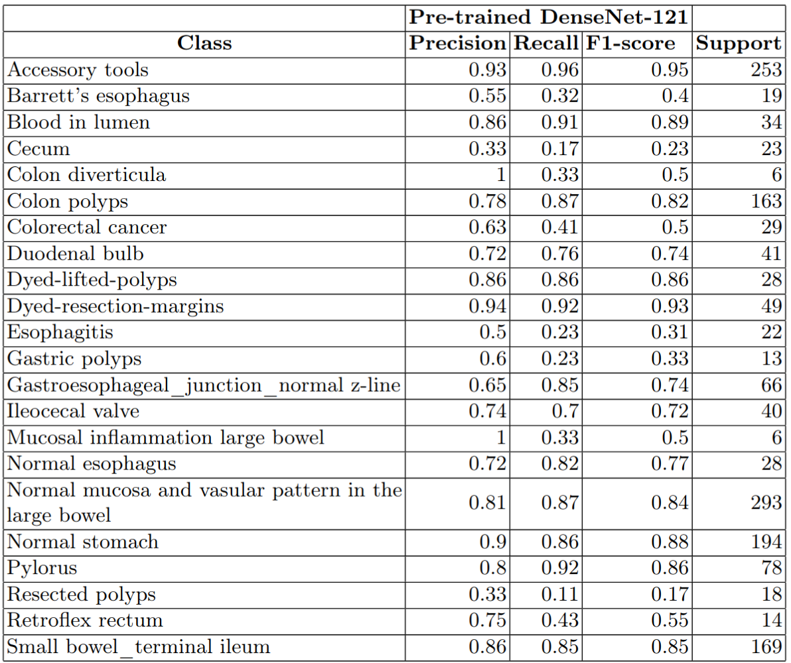
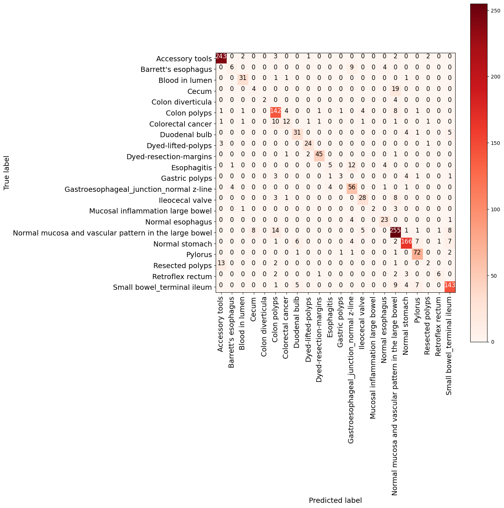
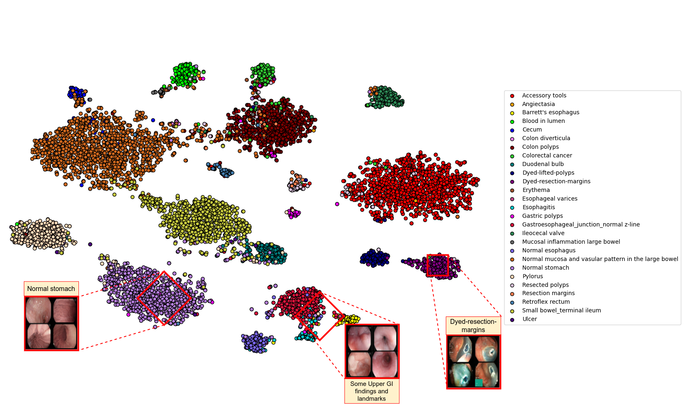

# GastroVision
This repository provides related links and codes for the GastroVision dataset, a multi-class endoscopy image dataset comprising the largest number of anatomical landmarks, pathological abnormalities, and normal findings in the gastrointestinal (GI) tract. A total of 27 such classes, with 8,000 images, are acquired from the upper and lower GI tracts.

The dataset can be downloaded using this link <https://osf.io/84e7f/>.



Alternatively, the dataset can also be downloaded using this link <https://drive.google.com/drive/folders/1T35gqO7jIKNxC-gVA2YVOMdsL7PSqeAa?usp=sharing>

- The metadata for the dataset can be found in **GastroVision_metadata.csv**, which contains the filename, class, width, height, and size of images.  
- The dataset split used in the paper is provided in the **Split** folder. This split contains 22 classes, as we performed experiments using classes with more than five samples. However, you can get the details of other classes from the **GastroVision_metadata.csv** file.  The users can use the provided split to reproduce the results presented in the paper and for a fair comparison.
- The code files used for the experiments reported in the paper are provided in the **Source** folder.

## How to run
**Train and Test:**
```sh
python3 model_filename.py -e(epochs) -b(batch size) -l(learning rate)
Eg. python3 DenseNet121_pretrained.py -e50 -b32 -l0.0001  
```
*model_filename.py* refers to "DenseNet-121_pretrained.py","DenseNet-169_pretrained.py", "EfficientNet-B0_pretrained.py", ResNet-50_pretrained.py","ResNet-50_endtoend.py" or "ResNet-152_pretrained.py" provided in the **Source** folder.

**Set path:**

In _model_filename.py_ (line numbers: 49-52):
- You can set the path for Train, Validation, and Test folders (line numbers: 49-51).
- *model_path* (line number:52) can be changed to the folder path where you want to store your model's checkpoints.

## Dataset Details
GastroVision, with two broad categories (upper GI and lower GI), covers 36 classes belonging to anatomical landmarks or pathological findings. Proper categorization of these classes can be visualized from the diagram given below.


*Figure 1: Classes of GI tracts provided in the dataset. A general division of  different findings in the upper and lower GI tract is presented.*

A detailed distribution of each class is represented in the graph below:


*Figure 2: The figure shows the number of images per class, excluding the normal class. Some classes have few samples, as it is challenging to obtain such samples in an endoscopic procedure.*


*Figure 3: Resolutions of the 8,000 images of GastroVision.*

## Evaluation Metrics
Standard multi-class classification metrics, such as Matthews Correlation Coefficient (MCC), micro and macro averages of recall/sensitivity, precision, and F1-score, can be used to validate the performance using our dataset.

## Baseline results
*Results for all classification experiments on the Gastrovision dataset.*


*Class-wise performance associated with the best outcome obtained using pre-trained DenseNet-121.*




*Confusion matrix for the best outcome obtained using pre-trained DenseNet-121.*



*Two-dimensional t-SNE embedding for GastroVision. The pre-trained DenseNet-121 model, which is further trained on our training set, is used to extract features. Some sample images are shown with either a specific or a broader (due to multiple overlapping classes) categorization.*


## Cite
If you use this dataset in your research work, please cite the following paper:

```
@inproceedings{jha2023gastrovision,
  title={GastroVision: A Multi-class Endoscopy Image Dataset for Computer Aided Gastrointestinal Disease Detection},
  author={Debesh Jha*, Vanshali Sharma*, Neethi Dasu, Nikhil Kumar Tomar, Steven Hicks, M.K. Bhuyan, Pradip K. Das, Michael A. Riegler, P{\aa}l Halvorsen, Thomas de Lange, Ulas Bagci}
  booktitle={ICML Workshop on Machine Learning for Multimodal Healthcare Data (ML4MHD 2023)},
  year={2023}
}
```

## Contact
Please contact debesh.jha@northwestern.edu  & Vanshalisharma@iit.ac.in if you have questions about the dataset and our research activities. We always welcome collaboration and joint research!
